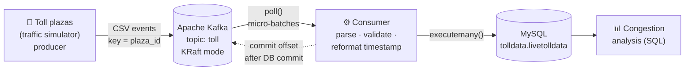
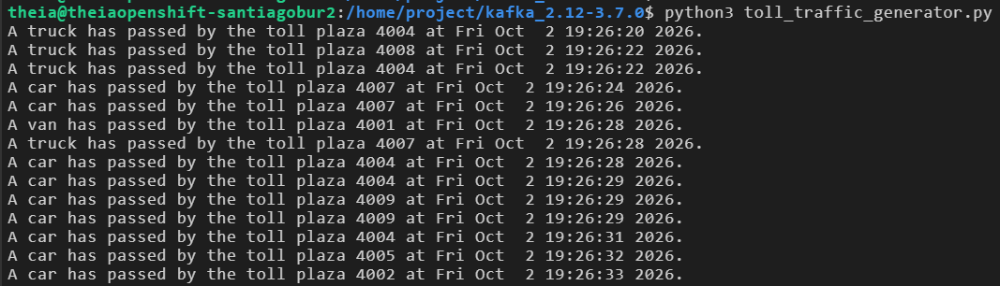
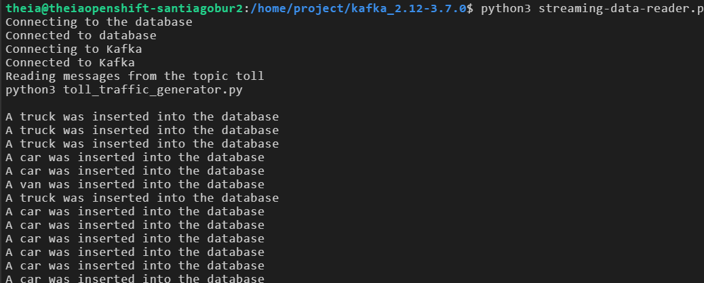
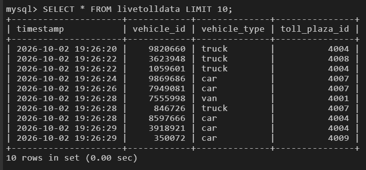

# 🚦 Toll Traffic Streaming ETL Pipeline — Apache Kafka → MySQL


-orange)


A **real-time streaming data pipeline** that ingests simulated vehicle events from national highway
toll plazas through **Apache Kafka**, transforms them in Python and loads them into **MySQL**
for traffic congestion analysis.

> Final project of the IBM course **"ETL and Data Pipelines with Shell, Airflow and Kafka"**
> (IBM Data Engineering Professional Certificate). Companion to my batch version:
> [toll-data-etl-airflow](https://github.com/SaBuMa/toll-data-etl-airflow).

---

## 📋 Table of Contents
- [Project Scenario](#-project-scenario)
- [Architecture](#-architecture)
- [Tech Stack](#-tech-stack)
- [Repository Structure](#-repository-structure)
- [Two Versions](#-two-versions)
- [How to Run](#-how-to-run)
- [Pipeline in Action](#-pipeline-in-action)
- [Analysis Queries](#-analysis-queries)
- [Testing](#-testing)
- [What I Learned](#-what-i-learned)
- [Future Improvements](#-future-improvements)
- [Author](#-author)

---

## 🎯 Project Scenario

As a data engineer at a data analytics consulting company, I was assigned to a project that aims to
**de-congest national highways** by analyzing road traffic data from toll plazas.
Each time a vehicle passes a plaza, an event with its `timestamp`, `vehicle_id`, `vehicle_type` and
`toll_plaza_id` is streamed to Kafka. The pipeline collects that stream and loads it into a database
in near real time.

---

## 🏗️ Architecture



| Stage | What happens | Example |
|---|---|---|
| **Extract** | Consumer reads raw events from the `toll` topic | `Fri Oct  2 19:26:20 2026,9820660,truck,4004` |
| **Transform** | Validate fields, convert `ctime` timestamp to MySQL `DATETIME`, cast ids to integers | `('2026-10-02 19:26:20', 9820660, 'truck', 4004)` |
| **Load** | Batch insert into `livetolldata`, then commit the Kafka offset | 1 row per vehicle |

New to Kafka? See **[docs/kafka-concepts.md](docs/kafka-concepts.md)**: the whole pipeline explained with a post office analogy.

---

## 🧰 Tech Stack

| Tool | Role |
|---|---|
| **Apache Kafka 3.7.0** (KRaft) | Distributed event streaming platform, no ZooKeeper |
| **Python 3** + `kafka-python` | Producer (simulator) and consumer (ETL) |
| **MySQL 8** + `mysql-connector-python` | Target database |
| **Bash** | Broker setup and topic creation scripts |
| **unittest** | Tests for the transform logic |

---

## 📁 Repository Structure

```
toll-traffic-streaming-kafka/
├── src/
│   ├── submission/                  # Course version (as submitted)
│   │   ├── toll_traffic_generator.py
│   │   └── streaming-data-reader.py
│   └── enhanced/                    # Portfolio version
│       ├── producer.py              # CLI options, keyed messages, safe shutdown
│       ├── consumer.py              # env config, micro-batches, at-least-once
│       └── transform.py             # pure parsing/validation logic (testable)
├── sql/
│   ├── 01_create_schema.sql         # database, table, index
│   └── 02_analysis_queries.sql      # congestion insights
├── scripts/
│   ├── setup_kafka.sh               # download + KRaft format + start broker
│   └── create_topic.sh              # idempotent topic creation
├── tests/
│   └── test_transform.py            # 8 unit tests, no Kafka/MySQL needed
├── docs/
│   ├── kafka-concepts.md            # post office analogy + diagrams
│   └── troubleshooting.md
├── screenshots/
├── .env.example                     # config template (real .env is git-ignored)
├── requirements.txt
├── LICENSE
└── README.md
```

---

## 🔀 Two Versions

| | `src/submission/` | `src/enhanced/` |
|---|---|---|
| Purpose | Course submission | Portfolio / production-style |
| Credentials | Hardcoded variables (placeholder here) | **Environment variables** (`.env`) |
| Failed DB connection | Continues and crashes with `NameError` | **Exits cleanly** with a clear error |
| Message key | None | **`plaza_id`** → per-plaza ordering |
| Delivery guarantee | Auto-commit offsets | **At-least-once** (offset committed after DB commit) |
| Start position | `latest` (misses earlier events) | **`earliest`** + consumer group |
| Inserts | 1 INSERT + 1 COMMIT per message | **Micro-batches** with `executemany()` |
| Bad messages | Crash the consumer | **Logged and skipped** |
| Shutdown | Ctrl+C traceback | **Graceful** (flush / close) |
| Tests | — | **8 unit tests** |
| Live run (Kafka 3.7 + MySQL) | ✅ | ✅ |

---

## 🚀 How to Run

> Tested in the IBM Skills Network Cloud IDE (Theia). The lab environment is not persistent,
> so the scripts make it quick to rebuild.

**1. Start Kafka** (terminal 1, leave it open)
```bash
./scripts/setup_kafka.sh
```

**2. Create the topic** (terminal 2)
```bash
./scripts/create_topic.sh
# Created topic toll.
```

**3. Create the database and table**
```bash
mysql --host=mysql --port=3306 --user=root -p < sql/01_create_schema.sql
```

**4. Install the Python drivers**
```bash
pip3 install -r requirements.txt
```

**5a. Run the course version**
```bash
# set PASSWORD in src/submission/streaming-data-reader.py first
python3 src/submission/streaming-data-reader.py   # terminal 2
python3 src/submission/toll_traffic_generator.py  # terminal 3
```

**5b. Or run the enhanced version**
```bash
cp .env.example .env            # then edit MYSQL_PASSWORD
set -a; source .env; set +a
python3 src/enhanced/consumer.py                       # terminal 2
python3 src/enhanced/producer.py --count 500 --max-delay 1   # terminal 3
```

**6. Verify**
```sql
USE tolldata;
SELECT * FROM livetolldata LIMIT 10;
```

---

## 🖥️ Pipeline in Action

**Producer:** the traffic simulator streaming vehicle events to the `toll` topic



**Consumer:** the reader connects to MySQL and Kafka, then loads each event



**Result:** streamed events stored in `livetolldata`, timestamps converted to `DATETIME`



*The same vehicles appear in all three screenshots (e.g. the truck at plaza 4004 at 19:26:20),
showing each event travelling producer → Kafka → consumer → MySQL within seconds.*

### Enhanced version: backlog catch-up, then real time

The enhanced consumer was started *after* events were already waiting in the topic.
Because it uses `auto_offset_reset="earliest"`, it loaded the whole backlog in one
micro-batch, then switched to near-real-time loading as new events arrived:

```text
[consumer] Connected to MySQL database 'tolldata'
[consumer] Reading topic 'toll' as consumer group 'toll-mysql-loader'
[consumer] Batch of 332 rows loaded (total 332, skipped 0)   ← backlog from offset 0
[consumer] Batch of 1 rows loaded (total 333, skipped 0)     ← live events
[consumer] Batch of 1 rows loaded (total 334, skipped 0)
[consumer] Batch of 1 rows loaded (total 335, skipped 0)
```

The course reader (`latest`) would have skipped those 332 events entirely.
Group-join retries on a fresh broker and replay duplicates are explained in
[docs/troubleshooting.md](docs/troubleshooting.md).

---

## 📊 Analysis Queries

[`sql/02_analysis_queries.sql`](sql/02_analysis_queries.sql) turns the raw stream into congestion insights:

| # | Question answered |
|---|---|
| 1 | Which toll plazas are the busiest? |
| 2 | What is the vehicle mix (car / truck / van)? |
| 3 | Which plazas have the highest share of trucks (slowest to process)? |
| 4 | What are the peak minutes per plaza? |
| 5 | Pipeline health: total rows and time window streamed |
| 6 | Data quality: were any events loaded twice? |

---

## 🧪 Testing

The transform logic lives in `transform.py` with no Kafka or MySQL imports, so it can be tested anywhere:

```bash
python3 -m unittest discover -s tests -v
# Ran 8 tests ... OK
```

Covered: valid messages, `ctime`'s double space before single-digit days, whitespace,
wrong field count, bad timestamps, unknown vehicle types, non-numeric ids and invalid UTF-8.

---

## 💡 What I Learned

- Running **Kafka in KRaft mode**: generating a cluster ID and formatting storage, without ZooKeeper
- The **producer / topic / consumer** model and how it decouples data sources from the database
- **Offsets and consumer groups**: why `latest` vs `earliest` changes what gets loaded
- **Delivery guarantees**: committing the offset only after the database commit gives at-least-once delivery
- **Message keys and partitions**: ordering is guaranteed per partition, so keying by plaza keeps each plaza's events in order
- Separating **pure transform logic** from I/O so it can be unit-tested
- Keeping **credentials out of source code** with environment variables
- Reading library logs: telling a harmless start-up retry (`NotCoordinatorError`) from a real failure
- **Replays create duplicates**: at-least-once delivery means the load step should be idempotent

---

## 🔭 Future Improvements

- [ ] `docker-compose.yml` to run Kafka + MySQL + producer + consumer with one command
- [ ] JSON or Avro messages with a schema registry instead of CSV strings
- [ ] Idempotent loads (event id + `INSERT IGNORE`) to remove at-least-once duplicates
- [ ] Dead-letter topic for invalid messages instead of only logging them
- [ ] Real-time aggregation (vehicles per plaza per minute) with Kafka Streams or Spark Structured Streaming
- [ ] Live dashboard (Grafana / Streamlit) on top of `livetolldata`

---

## 👤 Author

**Santiago Burgos** — Electronics Engineer transitioning into Data Engineering

[](https://github.com/SaBuMa)
[](https://www.linkedin.com/in/santiagoburgosm)

---

<sub>Project scenario and starter code (`src/submission/`) provided by IBM Skills Network as part of the
IBM Data Engineering Professional Certificate. Enhancements, scripts, tests and documentation by Santiago Burgos.</sub>
